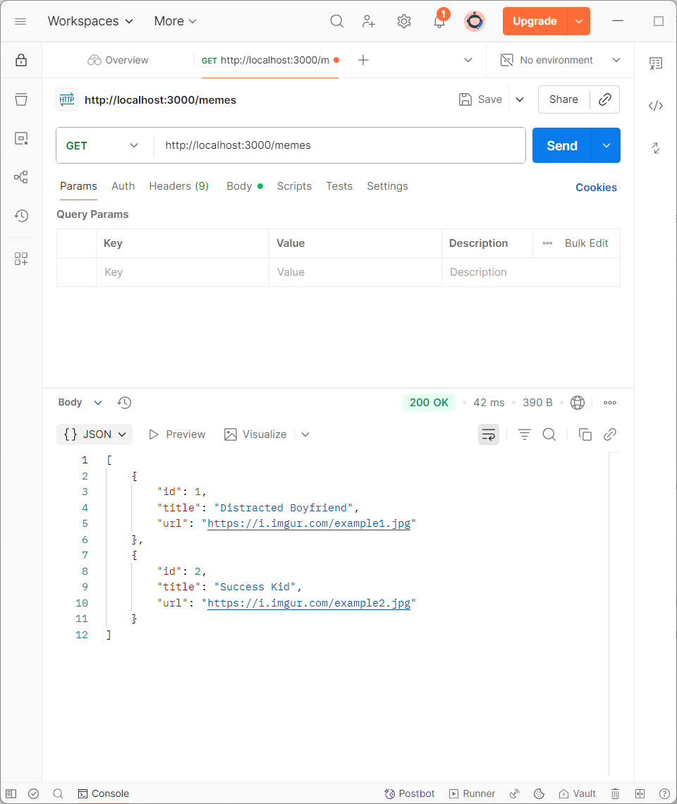
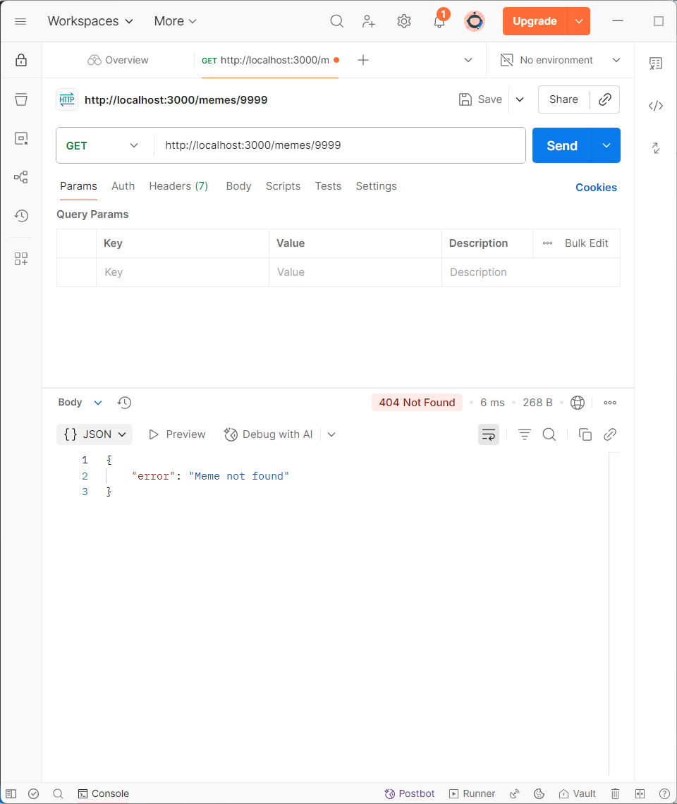
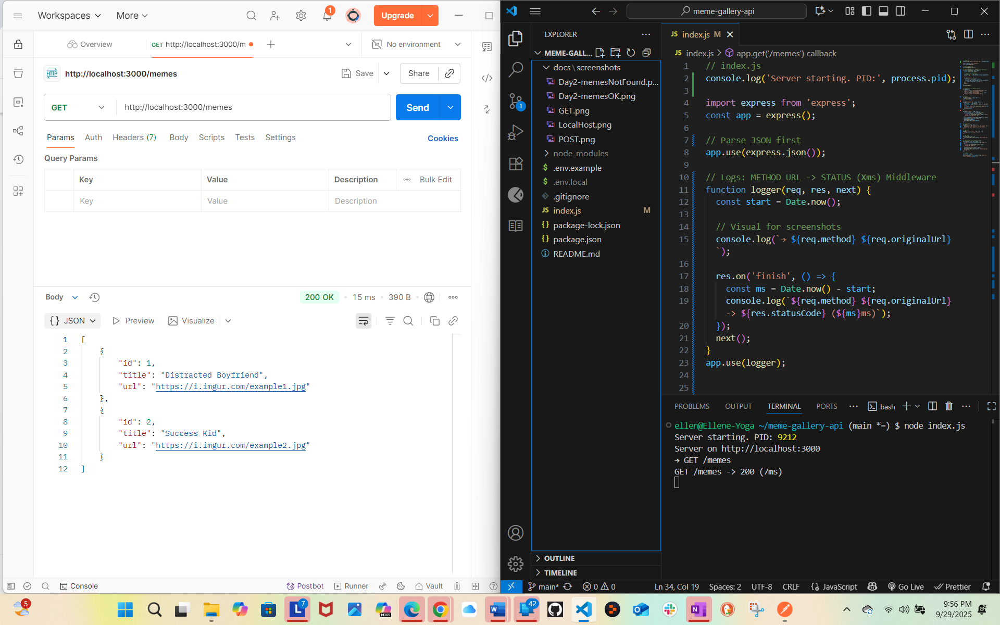
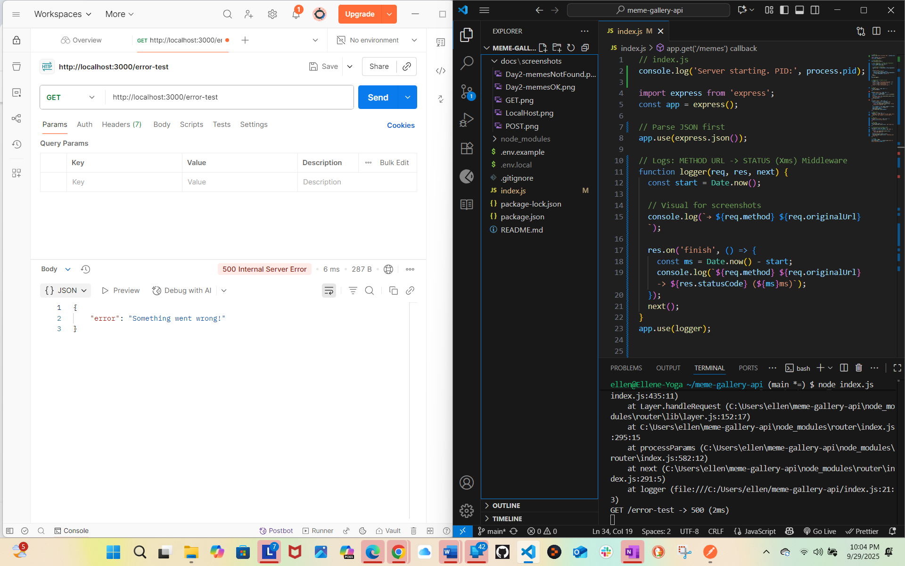
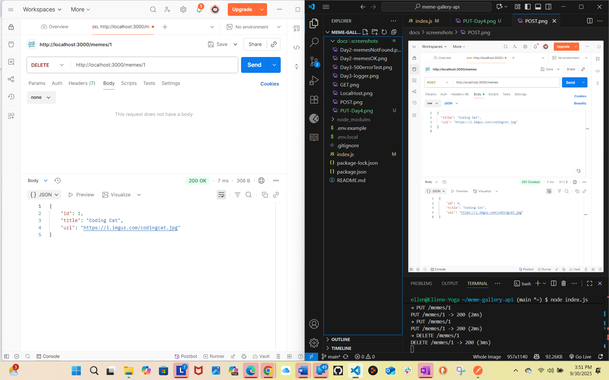

# Meme Gallery API

A  **Node + Express** API that serves and creates memes. Uses ES Modules and in-memory data (no database yet).

## Features
- Day 1: `GET /memes`, `POST /memes` with basic validation and JSON error handling
- Day 2: `GET /memes/:id` (fetch a single meme by id)
- Friendly root (`/`), JSON 404, and “Malformed JSON” handler

## Requirements
- Node.js 18+ (check with `node -v`)
- Postman for testing

## Quick Start
```bash
npm install
npm start
```
Server runs at: http://localhost:3000

## Environment Variables
This project supports a .env file (ignored by git). Example:

- #### .env.example  `PORT=3000`

- `.env.local`, (when we get to AWS) 

## Seeding (WHY _/memes/1_ works)
On server start, teh app seeds 2 items in memory so Day-2 tests work immediately:
```json
[
  { "id": 1, "title": "Distracted Boyfriend", "url": "https://i.imgur.com/example1.jpg" },
  { "id": 2, "title": "Success Kid", "url": "https://i.imgur.com/example2.jpg" }
]
```
Because data is in memory, restarting the server resets the list. 
(In my capstone I used this method to start my project without having to deal with AWS login 😏)

## Tech
- Node.js, Express

- ES6+: import, arrow functions, destructuring, async handler

- express.json() for JSON body parsing

## Project Structure
```
meme-gallery-api/
  ├─ index.js
  ├─ package.json
  ├─ package-lock.json
  ├─ .gitignore
  ├─ README.md
  ├─ postman_collection.json
  └─ docs/
     └─ screenshots/
        ├─ GET.png
        ├─ POST.png
        ├─ LocalHost.png
        ├─ Day3-logger.png  
        ├─ Day3-Day3-500errorTest.png
        ├─ PUT-Day4.png
        └─ DELETE-Day4.png

```
.gitignore
This repo ignores:

```bash
node_modules/
.env
.env.local
.env.*.local
.DS_Store
Thumbs.db
```
## API Summary
| Method | Route        | Purpose                   | Success | Error(s)                                     |
| -----: | ------------ | ------------------------- | :-----: | -------------------------------------------- |
|    GET | `/memes`     | List all memes            |   200   | —                                            |
|    GET | `/memes/:id` | Get a single meme by id   |   200   | 404 `{"error":"Meme not found"}`             |
|   POST | `/memes`     | Create a meme (JSON body) |   201   | 400 missing/blank fields; 400 malformed JSON |

## Request/Response examples

**GET** `_/memes_`
```json
[
  { "id": 1, "title": "Distracted Boyfriend", "url": "https://i.imgur.com/example1.jpg" },
  { "id": 2, "title": "Success Kid", "url": "https://i.imgur.com/example2.jpg" }
]
```

**GET `_/memes/:id_` **404**
```json
{ "error": "Meme not found" }
```
**POST** `_/memes_` (request)
```json
{ "title": "Coding Cat", "url": "https://i.imgur.com/codingcat.jpg" }
```
**201 Created**
```json
{ "id": 3, "title": "Coding Cat", "url": "https://i.imgur.com/codingcat.jpg" }
```
**404 Missing/blank**
```json
{ "error": "Title and URL are required." }
```
**400 Malformed JSON**
```json
{ "error": "Malformed JSON" }
```
**PUT** 
- Request
```json
{ "title": "Coding Cat", "url": "https://i.imgur.com/codingcat.jpg" }
```
- 200 OK
```json
{ "id": 1, "title": "Coding Cat", "url": "https://i.imgur.com/codingcat.jpg" }
```
- 404 Bad Request (if the field is blank)
```json
{ "error": "Title cannot be empty." }
```
- 404 Not Found
```json
{ "error": "Meme not found" }
```
**DELETE**
Delete a meme by id.
- 200 OK
```json
{ "id": 1, "title": "Coding Cat", "url": "https://i.imgur.com/codingcat.jpg" }
```
## How to Test
  ### Postman
1. `GET http://localhost:3000/memes` → expect 200 + list

2. `GET http://localhost:3000/memes/1` → expect 200 + single item

3. `GET http://localhost:3000/memes/9999` → expect 404 + `{ "error": "Meme not found" }`

4. `POST http://localhost:3000/memes`

- Body → raw → JSON (use the request example above)

- Expect 201 Created + the new object

### curl (Git Bash)
```bash
# GET all
curl -i http://localhost:3000/memes

# GET one (success)
curl -i http://localhost:3000/memes/1

# GET one (not found)
curl -i http://localhost:3000/memes/9999

# POST valid
curl -i -X POST http://localhost:3000/memes \
  -H "Content-Type: application/json" \
  -d '{"title":"Coding Cat","url":"https://i.imgur.com/codingcat.jpg"}'


# POST malformed (trailing comma) -> 400 Malformed JSON
curl -i -X POST http://localhost:3000/memes \
  -H "Content-Type: application/json" \
  -d '{"title":"Bad","url":"https://i.imgur.com/x.jpg",}'

# PUT `http://localhost:3000/memes/1`
Body → raw → JSON
{ "title": "Coding Cat", "url": "https://i.imgur.com/codingcat.jpg" }

Expect **200 OK** with updated object.

# DELETE `http://localhost:3000/memes/1
Expect **200 OK** with deleted object.
  ```
## Screenshots / Postman
**DAY 1**
- `docs/screenshots/GET.png`


- `docs/screenshots/POST.png`


- `docs/screenshots/LocalHost.png`

**DAY 2**
- `GET-id-200.png` – `GET /memes/1` (200 OK)
- 
- `GET-id-404.png` – `GET /memes/9999` (404 Not Found)

**Day 3**
- Logger Proof

- 500 error Proof
  
**Day 4**
- `PUT-Day4.png` – Postman showing 200 OK from `PUT /memes/:id`
.png)
- `Day4-delete.png` – Postman showing 200 OK from `DELETE /memes/:id`


## Notes
- Data is in-memory. Restarting the server resets the list.

- `package.json` includes `"type": "module"` so we can use `import`.

## Next Steps (Stretch)
- Stronger URL validation

- Connect to a real database (MongoDB/SQLite/Postgres)

- Deploy to Vercel or Render

- Add nodemon for auto-restart:

```bash
npm i -D nodemon
npm run dev
```