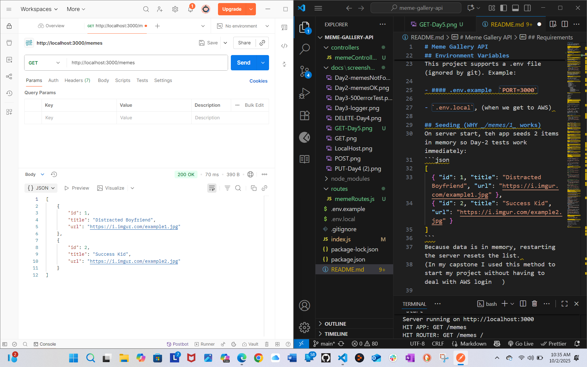
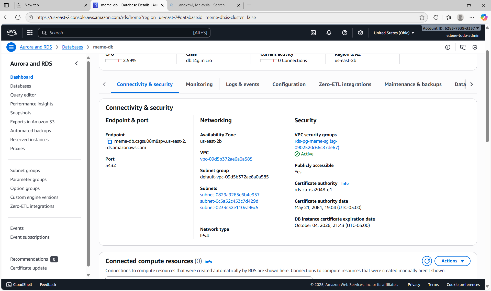
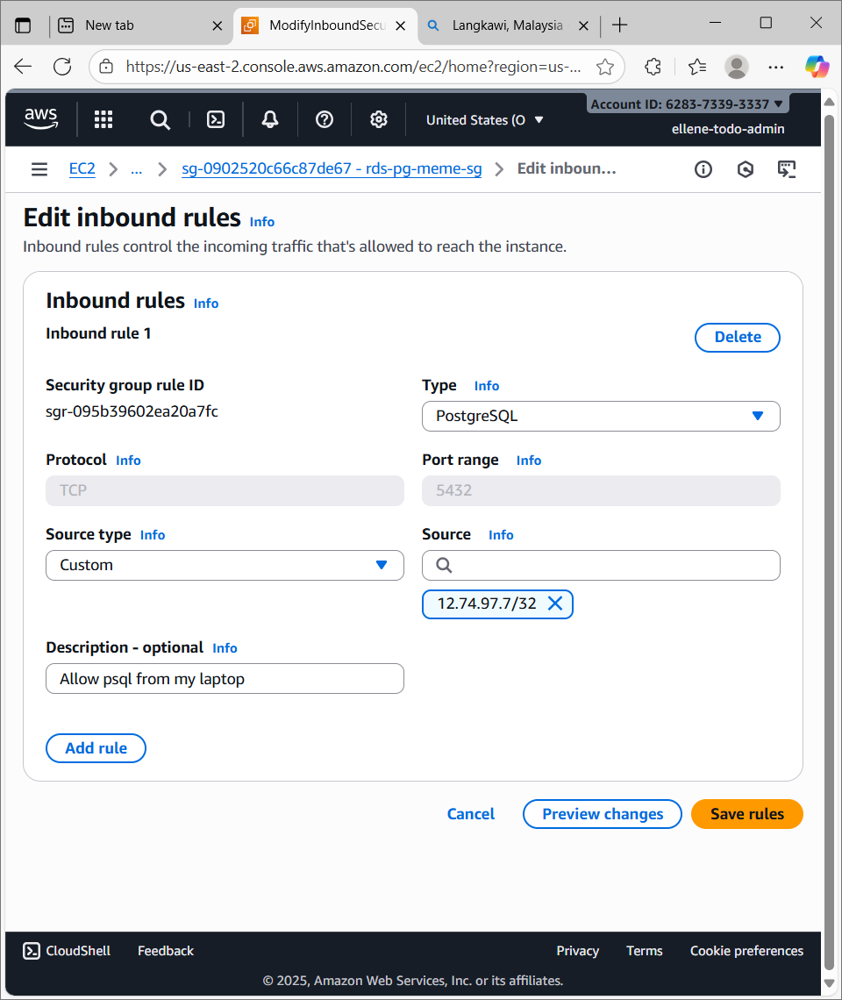
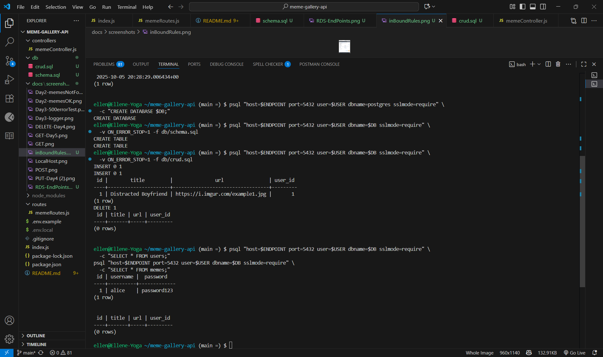

# Meme Gallery API

A **Node + Express** API that serves and creates memes. Uses ES Modules and (for now) in-memory data. Day 1 of the DB module adds an **AWS RDS PostgreSQL** instance with tables + sample CRUD tested via `psql`.

## Features
- Day 1 (API): `GET /memes`, `POST /memes` (validation + JSON error handling)
- Day 2: `GET /memes/:id` (fetch a single meme by id)
- Day 3: Request logger + centralized error handler (malformed JSON/500s)
- Day 4: `PUT /memes/:id`, `DELETE /memes/:id`
- Day 5: **MVC refactor** (`routes/`, `controllers/`)
- DB Module Day 1 (RDS): Created PostgreSQL on AWS RDS, ran `db/schema.sql` + `db/crud.sql` via `psql`, and captured screenshots (endpoint, SG inbound rule, queries).

## Requirements
- Node.js 18+ (`node -v`)
- npm
- Postman (or curl) for testing
- **PostgreSQL client (`psql`)** installed locally (used to talk to AWS RDS)

## Quick Start
```bash
npm install
npm start
# (optional) with nodemon if you added it:
# npm run dev

Server runs at: http://localhost:3000

## Environment Variables
This project supports a .env file (ignored by git). 

- #### .env.example  `PORT=3000`

- `.env.local` 

## Seeding (WHY _/memes/1_ works)
On server start, teh app seeds 2 items in memory so Day-2 tests work immediately:
```json
[
  { "id": 1, "title": "Distracted Boyfriend", "url": "https://i.imgur.com/example1.jpg" },
  { "id": 2, "title": "Success Kid", "url": "https://i.imgur.com/example2.jpg" }
]
```
Because data is in memory, restarting the server resets the list. 
(In my capstone I used this method to start my project without having to deal with AWS login 😏)

## Tech
- Node.js, Express
- ES6+: import, arrow functions, destructuring, async handler
- express.json() for JSON body parsing
- Middleware logger (METHOD URL → STATUS in ms)
- Centralized error handler + JSON 404s
- MVC separation (routes ↔ controllers)
- AWS RDS PostgreSQL (via psql for this module)

## Project Structure
```
meme-gallery-api/
  ├─ index.js
  ├─ controllers/
  │   └─ memeController.js
  ├─ routes/
  │   └─ memeRoutes.js
  ├─ db/
  │   ├─ schema.sql         # CREATE TABLE users, memes
  │   └─ crud.sql           # INSERT/SELECT/UPDATE/DELETE samples
  ├─ docs/
  │   └─ screenshots/
  │       ├─ GET.png
  │       ├─ POST.png
  │       ├─ LocalHost.png
  │       ├─ Day3-logger.png
  │       ├─ Day3-500errorTest.png
  │       ├─ PUT-Day4.png
  │       ├─ DELETE-Day4.png
  │       ├─ GET-Day5.png
  │       ├─ wk2Day1RDS-Endpoints.png      
  │       ├─ wk2Day1inBoundRules.png
  |       └─ wk2Day1psql-SchemaandCRUD.png                          
  ├─ .env.example
  ├─ .gitignore
  ├─ package.json
  └─ README.md

```
.gitignore
This repo ignores:

```bash
node_modules/
.env
.env.local
.env.*.local
.DS_Store
Thumbs.db
```
## API Summary
| Method | Route        | Purpose                   | Success | Error(s)                                     |
| -----: | ------------ | ------------------------- | :-----: | -------------------------------------------- |
|    GET | `/memes`     | List all memes            |   200   | —                                            |
|    GET | `/memes/:id` | Get a single meme by id   |   200   | 404 `{"error":"Meme not found"}`             |
|   POST | `/memes`     | Create a meme (JSON body) |   201   | 400 missing/blank fields; 400 malformed JSON |
|    PUT | `/memes/:id` | Update a meme by id       |   200   | 400 empty field; 404 not found               |
| DELETE | `/memes/:id` | Delete a meme by id       |   200   | 404 not found                                |


## Request/Response examples

**GET** `_/memes_`
```json
[
  { "id": 1, "title": "Distracted Boyfriend", "url": "https://i.imgur.com/example1.jpg" },
  { "id": 2, "title": "Success Kid", "url": "https://i.imgur.com/example2.jpg" }
]
```

**GET `_/memes/:id_` **404**
```json
{ "error": "Meme not found" }
```
**POST** `_/memes_` (request)
```json
{ "title": "Coding Cat", "url": "https://i.imgur.com/codingcat.jpg" }
```
**201 Created**
```json
{ "id": 3, "title": "Coding Cat", "url": "https://i.imgur.com/codingcat.jpg" }
```
**404 Missing/blank**
```json
{ "error": "Title and URL are required." }
```
**400 Malformed JSON**
```json
{ "error": "Malformed JSON" }
```
**PUT** 
- Request
```json
{ "title": "Coding Cat", "url": "https://i.imgur.com/codingcat.jpg" }
```
- 200 OK
```json
{ "id": 1, "title": "Coding Cat", "url": "https://i.imgur.com/codingcat.jpg" }
```
- 404 Bad Request (if the field is blank)
```json
{ "error": "Title cannot be empty." }
```
- 404 Not Found
```json
{ "error": "Meme not found" }
```
**DELETE**
Delete a meme by id.
- 200 OK
```json
{ "id": 1, "title": "Coding Cat", "url": "https://i.imgur.com/codingcat.jpg" }
```
## How to Test
  ### Postman
1. `GET http://localhost:3000/memes` → expect 200 + list

2. `GET http://localhost:3000/memes/1` → expect 200 + single item

3. `GET http://localhost:3000/memes/9999` → expect 404 + `{ "error": "Meme not found" }`

4. `POST http://localhost:3000/memes` → (Body → raw → JSON) → Expect 201 Created
5. `PUT http://localhost:3000/memes/1` → 200 updated object
6. `DELETE http://localhost:3000/memes/1` → 200 deleted object

### curl (Git Bash)
```bash
# GET all
curl -i http://localhost:3000/memes

# GET one (success)
curl -i http://localhost:3000/memes/1

# GET one (not found)
curl -i http://localhost:3000/memes/9999

# POST valid
curl -i -X POST http://localhost:3000/memes \
  -H "Content-Type: application/json" \
  -d '{"title":"Coding Cat","url":"https://i.imgur.com/codingcat.jpg"}'


# POST malformed (trailing comma) -> 400 Malformed JSON
curl -i -X POST http://localhost:3000/memes \
  -H "Content-Type: application/json" \
  -d '{"title":"Bad","url":"https://i.imgur.com/x.jpg",}'

# PUT `http://localhost:3000/memes/1`
Body → raw → JSON
{ "title": "Coding Cat", "url": "https://i.imgur.com/codingcat.jpg" }

Expect **200 OK** with updated object.

# DELETE `http://localhost:3000/memes/1
Expect **200 OK** with deleted object.
  ```
# AWS RDS (DB Module Day 1)

**What I created**

- RDS PostgreSQL instance in `us-east-2` (Public access: Yes for class)

- Security group allowing inbound **TCP 5432** from my IP

- Database: `meme_gallery`

- Tables: `users`, `memes`
**Run the SQL files with psql**
```bash
# set these for your shell session
export ENDPOINT="your-endpoint.rds.amazonaws.com"
export USER="meme_master"
export DB="meme_gallery"
export PGPASSWORD="••••••••"   # optional; otherwise psql prompts

# 1) create the database (connect to default 'postgres' db)
psql "host=$ENDPOINT port=5432 user=$USER dbname=postgres sslmode=require" \
  -c "CREATE DATABASE $DB;"

# 2) run schema + crud against meme_gallery
psql "host=$ENDPOINT port=5432 user=$USER dbname=$DB sslmode=require" \
  -v ON_ERROR_STOP=1 -f db/schema.sql

psql "host=$ENDPOINT port=5432 user=$USER dbname=$DB sslmode=require" \
  -v ON_ERROR_STOP=1 -f db/crud.sql
```

## Screenshots / Postman
**DAY 1**
- `docs/screenshots/GET.png`


- `docs/screenshots/POST.png`


- `docs/screenshots/LocalHost.png`

**DAY 2**
- `GET-id-200.png` – `GET /memes/1` (200 OK)
- 
- `GET-id-404.png` – `GET /memes/9999` (404 Not Found)

**Day 3**
- Logger Proof

- 500 error Proof
  
**Day 4**
- `PUT-Day4.png` – Postman showing 200 OK from `PUT /memes/:id`
.png)
- `Day4-delete.png` – Postman showing 200 OK from `DELETE /memes/:id`

**Day 5**
- mvc-structure addded controllers/ and routes/ folders

**Week 2 Day 1**
- RDS instance details (Endpoint/port/SG)
- 
- Security group inbound rule 5432 from my IP

- Terminal showing schema+CRUD queries succeeding

## What’s inside

ESM ("type": "module" in package.json)

- Logging middleware: logs METHOD URL -> STATUS (ms) for every request

- Centralized error handler:

  - bad JSON → 400 { "error": "Malformed JSON" }
  - unexpected errors → 500 { "error": "Something went wrong!" }

- 404 JSON for unknown routes

- MVC refactor (Day 5): routes ↔ controllers separation to prep for a DB later

## Next Steps (Stretch)
- Stronger URL validation

- Deploy to Vercel or Render

- Add nodemon for auto-restart:

```bash
npm i -D nodemon
npm run dev
```
# Changelog

- Day 1: Basic Express server; GET /memes, POST /memes.

- Day 2: GET /memes/:id with 404s.

- Day 3: Request logging + centralized error handling.

- Day 4: PUT /memes/:id and DELETE /memes/:id.

- Day 5: MVC refactor (routes + controllers).

- DB Module Day 1: AWS RDS PostgreSQL set up; schema.sql + crud.sql executed via psql