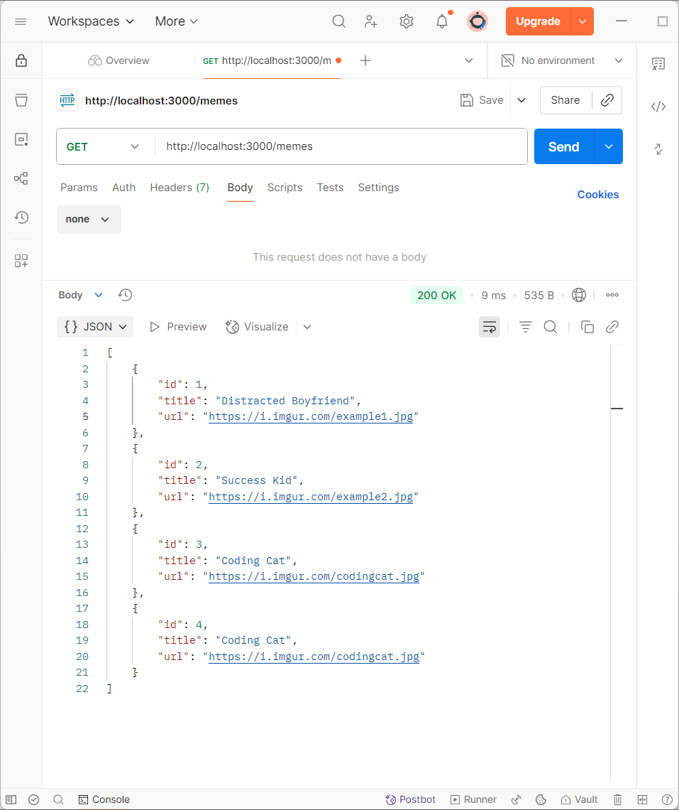
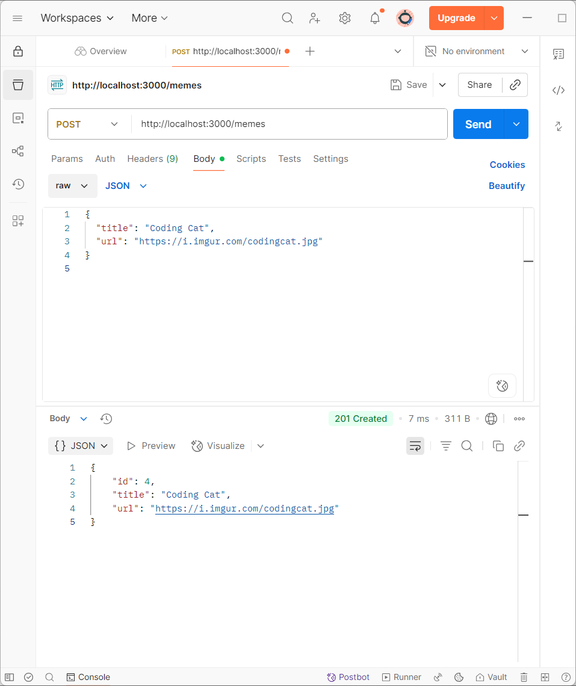
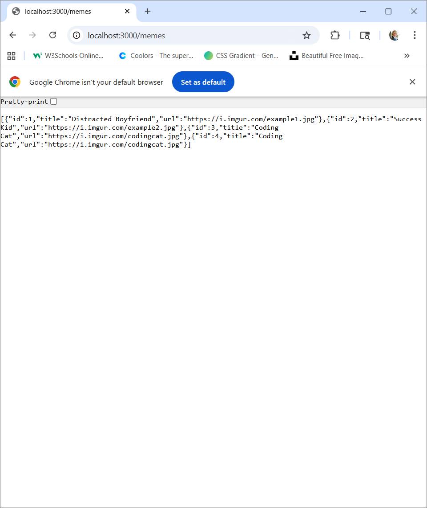

# Meme Gallery API

A  **Node + Express** API that serves and creates memes. Uses ES Modules and in-memory data (no database yet).

## Requirements
- Node.js 18+ (check with `node -v`)
- Postman for testing

## Quick Start
```bash
npm install
npm start
```
Server runs at: http://localhost:3000

## Environment Variables
This project supports a .env file (ignored by git). Example:

- #### .env.example  `PORT=3000`

- `.env.local`, (when we get to AWS) 

## Tech
- Node.js, Express

- ES6+: import, arrow functions, destructuring, async handler

- express.json() for JSON body parsing

## Project Structure
```
meme-gallery-api/
  ├─ index.js
  ├─ package.json
  ├─ package-lock.json
  ├─ .gitignore
  ├─ README.md
  ├─ postman_collection.json
  └─ docs/
     └─ screenshots/
        ├─ GET.png
        ├─ POST.png
        └─ LocalHost.png
```
.gitignore
This repo ignores:

```bash
node_modules/
.env
.env.local
.env.*.local
.DS_Store
Thumbs.db
```
## Endpoints
GET `/memes`

Returns all memes.

#### 200 OK

```json
[
  { "id": 1, "title": "Distracted Boyfriend", "url": "https://i.imgur.com/example1.jpg" },
  { "id": 2, "title": "Success Kid", "url": "https://i.imgur.com/example2.jpg" }
]
```
GET `/memes/:id`
Returns a single meme by id.

#### 200 OK
```json
{ "id": 1, "title": "Distracted Boyfriend", "url": "https://i.imgur.com/example1.jpg" }
```
**404 Not Found**
```json
{ "error": "Meme not found" }
```
**POST `/memes`**
Create a meme. Body must be JSON.

### Request
```json
{ "title": "Coding Cat", "url": "https://i.imgur.com/codingcat.jpg" }
```
### 201 Created
```json
{ "id": 3, "title": "Coding Cat", "url": "https://i.imgur.com/codingcat.jpg" }
```
### Validation & Errors
- Missing/blank title or url → 400
```json
{ "error": "Title and URL are required." }
```
- Malformed JSON → 400
```json
{ "error": "Malformed JSON" }
```
- Unknown route → 404
```json
{ "error": "Not found" }
```
## How to Test
  ### Postman
1. `GET http://localhost:3000/memes` → expect 200 + list

2. `GET http://localhost:3000/memes/1` → expect 200 + single item

3. `GET http://localhost:3000/memes/9999` → expect 404 + `{ "error": "Meme not found" }`

4. `POST http://localhost:3000/memes`

- Body → raw → JSON (use the request example above)

- Expect 201 Created + the new object

### curl (Git Bash)
```bash
# GET all
curl -i http://localhost:3000/memes

# GET one (success)
curl -i http://localhost:3000/memes/1

# GET one (not found)
curl -i http://localhost:3000/memes/9999

# POST valid
curl -i -X POST http://localhost:3000/memes \
  -H "Content-Type: application/json" \
  -d '{"title":"Coding Cat","url":"https://i.imgur.com/codingcat.jpg"}'


# POST malformed (trailing comma) -> 400 Malformed JSON
curl -i -X POST http://localhost:3000/memes \
  -H "Content-Type: application/json" \
  -d '{"title":"Bad","url":"https://i.imgur.com/x.jpg",}'
  ```
## Screenshots / Postman
`docs/screenshots/GET.png`



`docs/screenshots/POST.png`



`docs/screenshots/LocalHost.png`


## Notes
- Data is in-memory. Restarting the server resets the list.

- `package.json` includes `"type": "module"` so we can use `import`.

## Next Steps (Stretch)
- Stronger URL validation

- PUT/PATCH/DELETE routes

- Connect to a real database (MongoDB/SQLite/Postgres)

- Deploy to Vercel or Render

- Add nodemon for auto-restart:

```bash
npm i -D nodemon
npm run dev
```