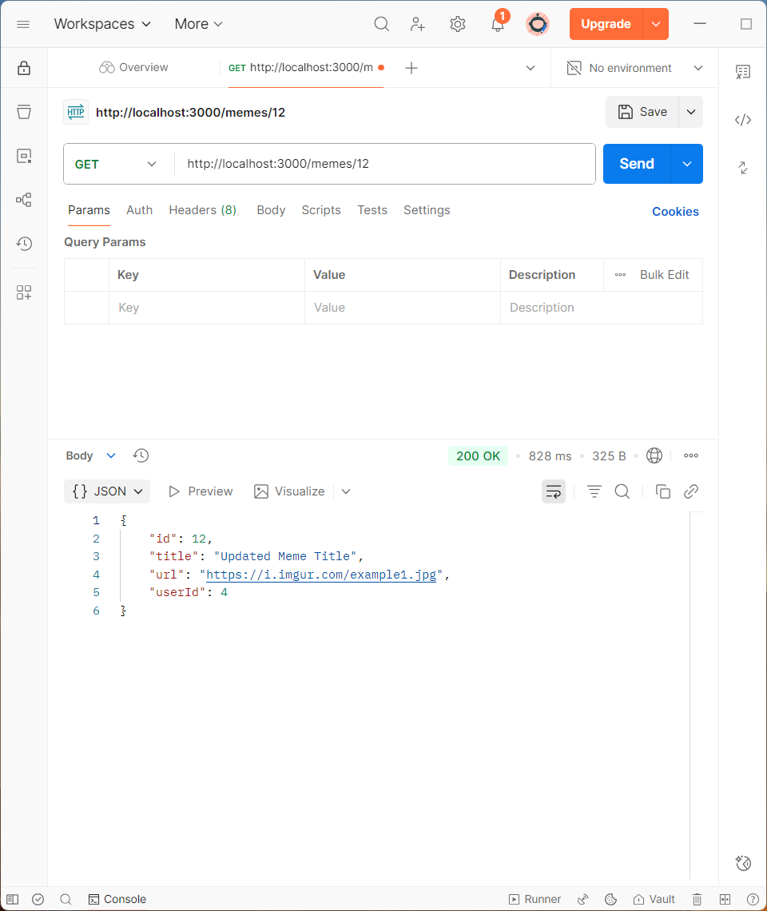

# Meme Gallery API

A **Node + Express** API that uses **Prisma ORM + AWS RDS PostgreSQL** (no more in-memory data). ES Modules, JSON error handling, and MVC layout.

## Features
- Day 1 (API): `GET /memes`, `POST /memes` (validation + JSON error handling)
- Day 2: `GET /memes/:id` (fetch a single meme by id)
- Day 3: Request logger + centralized error handler (malformed JSON/500s)
- Day 4: `PUT /memes/:id`, `DELETE /memes/:id`
- Day 5: **MVC refactor** (`routes/`, `controllers/`)
- Week 2 (RDS): Created AWS RDS PostgreSQL and connected via Prisma
- Users → Memes relation: `GET /users/:id/memes` (Prisma relations)

## Requirements
- Node.js 18+ (check with `node -v`)
- npm
- AWS RDS PostgreSQL instance (endpoint, username, password)
- Prisma CLI (devDependency)
- Postman or curl

## Quick Start
```bash
npm install
# set DATABASE_URL in .env

# generate prisma client
npm run prisma:generate

# run first migration (or see note on drift)
npm run db:migrate

# optional: seed sample data
npm run db:seed

# start API
npm run dev
# Server: http://localhost:3000
Server runs at: http://localhost:3000

## Environment

Create `.env` from `.env.example`:

```ini
PORT=3000
DATABASE_URL="postgresql://<username>:<password>@<rds-endpoint>:5432/meme_gallery?schema=public&sslmode=require"
```

Note (schema drift): If Prisma warns your DB is out of sync with migration history, prefer `npx prisma db push` to sync without data loss. Only use `npx prisma migrate reset` if you are okay losing data.

## Prisma Models
`prisma/schema.prisma`
```prisma
datasource db {
  provider = "postgresql"
  url      = env("DATABASE_URL")
}

generator client {
  provider = "prisma-client-js"
}

model User {
  id       Int     @id @default(autoincrement())
  username String  @unique
  password String
  memes    Meme[]

  @@map("users")
}

model Meme {
  id     Int    @id @default(autoincrement())
  title  String
  url    String
  userId Int    @map("user_id")
  user   User   @relation(fields: [userId], references: [id])

  @@index([userId])
  @@map("memes")
}

```

## Tech
- Node.js, Express

- ES modules, async/await

- express.json() for body parsing

- Middleware logger (METHOD URL → STATUS in ms)

- Centralized error handler + JSON 404s

- MVC separation (routes ↔ controllers)

- AWS RDS PostgreSQL via Prisma
- 
## Project Structure
```
meme-gallery-api/
  ├─ index.js
  ├─ controllers/
  │   ├─ memeController.js
  │   └─ userController.js
  ├─ routes/
  │   ├─ memeRoutes.js
  │   └─ users.js
  ├─ prisma/
  │   ├─ schema.prisma
  │   └─ seed.js
  ├─ db/                 # Week 2 Day 1 (psql-based)
  │   ├─ schema.sql
  │   └─ crud.sql
  ├─ docs/screenshots/
  ├─ .env.example
  ├─ .gitignore
  ├─ package.json
  └─ README.md
```
`.gitignore`

```bash
node_modules/
.env
.env.local
.env.*.local
.DS_Store
Thumbs.db
```
## API Summary
| Method | Route              | Purpose                         | Success | Error(s)                                                                 |
|------:|--------------------|---------------------------------|:------:|--------------------------------------------------------------------------|
|   GET | `/memes`           | List all memes                  |  200   | —                                                                        |
|   GET | `/memes/:id`       | Get a single meme by id         |  200   | 400 invalid id; 404 `{"error":"Meme not found"}`                         |
|  POST | `/memes`           | Create a meme (JSON body)       |  201   | 400 missing/blank; 400 malformed JSON; 400 invalid `userId` (foreign key)|
|   PUT | `/memes/:id`       | Update a meme by id             |  200   | 400 empty field/invalid id; 404 not found                                |
| DELETE| `/memes/:id`       | Delete a meme by id             |  200   | 400 invalid id; 404 not found                                            |
|   GET | `/users/:id/memes` | List memes for a user |  200 | 400 invalid id; 404 `{"error":"User not found"}`                         |


## Request/Response examples (Postman)
  
### GET `/memes` 
```json
[
  {
    "id": 12,
    "title": "Distracted Boyfriend",
    "url": "https://i.imgur.com/example1.jpg",
    "user": { "id": 4, "username": "alice" }
  },
  {
    "id": 13,
    "title": "Success Kid",
    "url": "https://i.imgur.com/example2.jpg",
    "user": { "id": 4, "username": "alice" }
  }
]
```
### GET `/memes/:id` (404)
```json
{ "error": "Meme not found" }
```
### POST /`memes`

### Body
```json
{ "title": "Coding Cat", "url": "https://i.imgur.com/codingcat.jpg", "userId": 4 }
```

### 201 Created 
```json
{ "id": 17, "title": "Coding Cat", "url": "https://i.imgur.com/codingcat.jpg", "userId": 4 }
```

### 400 Invalid FK
```json
{ "error": "Invalid userId (foreign key)" }
```
### PUT `/memes/:id`

### Body
```json
{ "title": "Updated Meme Title" }
```

### 200 OK
```json
{ "id": 17, "title": "Updated Meme Title", "url": "https://i.imgur.com/codingcat.jpg", "userId": 4 }
```
DELETE /memes/:id

### GET /users/:id/memes
```json
[
  { "id": 12, "title": "Distracted Boyfriend", "url": "https://i.imgur.com/example1.jpg", "userId": 4 },
  { "id": 13, "title": "Success Kid", "url": "https://i.imgur.com/example2.jpg", "userId": 4 }
]
```
## curl (bash in 2nd terminal)

### GET one (not found)
```bash
curl -i http://localhost:3000/memes/9999
```
### POST valid
```bash
curl -i -X POST http://localhost:3000/memes \
  -H "Content-Type: application/json" \
  -d '{"title":"Coding Cat","url":"https://i.imgur.com/codingcat.jpg","userId":4}'
```
### POST malformed (trailing comma) -> 400 Malformed JSON
```bash
curl -i -X POST http://localhost:3000/memes \
  -H "Content-Type: application/json" \
  -d '{"title":"Bad","url":"https://i.imgur.com/x.jpg",}'
```
### PUT
```bash
curl -i -X PUT http://localhost:3000/memes/1 \
  -H "Content-Type: application/json" \
  -d '{"title":"Coding Cat","url":"https://i.imgur.com/codingcat.jpg"}'
```
### DELETE
```bash
curl -i -X DELETE http://localhost:3000/memes/1
```-

## How to Test
  ### Postman
1. `GET http://localhost:3000/memes` → expect 200 + list

2. `GET http://localhost:3000/memes/1` → expect 200 + single item

3. `GET http://localhost:3000/memes/9999` → expect 404 + `{ "error": "Meme not found" }`

4. `POST http://localhost:3000/memes` → (Body → raw → JSON) → Expect 201 Created
5. `PUT http://localhost:3000/memes/1` → 200 updated object
6. `DELETE http://localhost:3000/memes/1` → 200 deleted object
```

## Screenshots / Postman

### Day 1
- ## `docs/screenshots/GET.png`  
  
- ## `docs/screenshots/POST.png`  
  
- ## `docs/screenshots/LocalHost.png`  
  

### Day 2
- ## `docs/screenshots/Day2-memesOK.png` (GET /memes/1 → 200)  
  
- ## `docs/screenshots/Day2-memesNotFound.png` (GET /memes/9999 → 404)  
  

### Day 3
- ## `docs/screenshots/Day3-logger.png`  
  
- ## `docs/screenshots/Day3-500errorTest.png`  
  

### Day 4 — Prisma relations (`GET /users/:id/memes`)
- ## `docs/screenshots/Day4-users-4-memes-200.png` (GET /users/4/memes → 200)  
  
- ## `docs/screenshots/Day4-users-99999-memes-404.png` (GET /users/99999/memes → 404)  
  

### Day 5 — CRUD with Prisma on RDS
- ## `docs/screenshots/Day5-POST-memes-201.png` (POST /memes → 201)  
  
- ## `docs/screenshots/Day5-GET-memes-200.png` (GET /memes → 200)  
  
- ## `docs/screenshots/Day5-GET-memes-id-200.png` (GET /memes/{id} → 200)  
  
- ## `docs/screenshots/Day5-PUT-memes-id-200.png` (PUT /memes/{id} → 200)  
  
- ## `docs/screenshots/Day5-DELETE-memes-id-200.png` (DELETE /memes/{id} → 200)  
  
- ## `docs/screenshots/Day5-DELETE-memes-id-404.png` (DELETE same id again → 404)  
  

### Week 2 Day 1 — RDS setup (historical reference)
- ## `docs/screenshots/wk2Day1RDS-EndPoints.png`  
  
- ## `docs/screenshots/wk2Day1inBoundRules.png`  
  
- ## `docs/screenshots/wk2Day1psql-Schema-and-CRUD.png`  
  

### Week 2 — Prisma + RDS
- ## `docs/screenshots/Day3-prisma-migrate.png`  
  
- ## `docs/screenshots/Day3-Prisma-Models.png`  
  
- ## `docs/screenshots/Day3-03-prisma-studio-memes.png`  
  
- ## `docs/screenshots/Day3-POST-Prisma-201.png`  
  


## What’s inside

- ESM ("type": "module" in package.json)

- Logging middleware: logs METHOD URL → STATUS (ms)

- Centralized error handler:

- bad JSON → 400 { "error": "Malformed JSON" }

- unexpected → 500 { "error": "Something went wrong!" }

- 404 JSON for unknown routes

- MVC refactor (Day 5): routes ↔ controllers separation

- Prisma + AWS RDS PostgreSQL

## Next Steps (Stretch)

- Deploy to Vercel or Render

```bash
npm i -D nodemon
npm run dev
```
# Changelog

- Day 1: Basic Express server; GET /memes, POST /memes.

- Day 2: GET /memes/:id with 404s.

- Day 3: Request logging + centralized error handling.

- Day 4: PUT /memes/:id and DELETE /memes/:id.

- Day 5: MVC refactor (routes + controllers).

- Week 2 Day 1: AWS RDS PostgreSQL set up; schema.sql + crud.sql executed via psql

- Week 2 Day 3: Prisma + RDS integration; DB-backed CRUD; seed + Studio